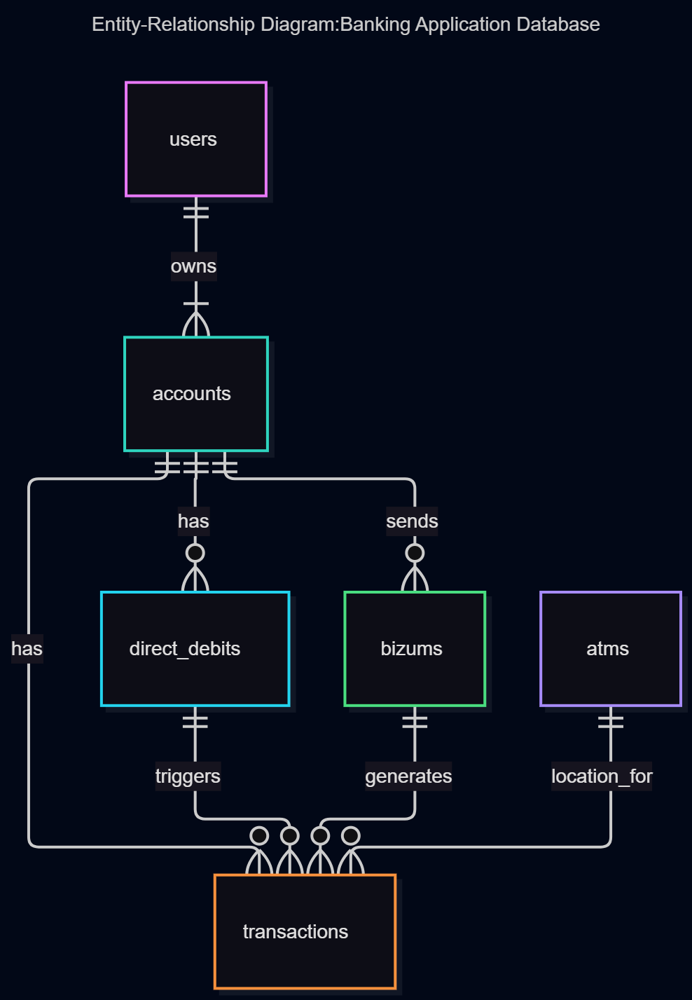

# Design Document: Banking Application Database

By Alejandro Hernández Esturao

Video overview: <[URL HERE](https://www.loom.com/share/2136aa7df1f74c9aa89709e18f6c7143)>

## Scope

### Purpose
The objective of this database is to model a modern, real-world retail banking application. It handles core financial operations such as user management, multi-account tracking, peer-to-peer mobile payments (**Bizum**), automated recurring bills (**Direct Debits**), cash withdrawals at **ATMs**, and a centralized transaction ledger.

### Target Audience
*   **Bank Customers:** Who need to check their current balance, view detailed transaction histories, send instant money via phone numbers, and manage recurrent expenses.
*   **Bank Administrators / System:** Who require strict data integrity, fast lookups for account statements, and secure storage of user credentials.

---

## Logical Design

The relational model consists of 6 core tables interacting to maintain financial consistency:

1.  **`users`**: Stores personal client credentials. A user can own multiple bank accounts and is uniquely identified by their mobile phone number (essential for Bizum).
2.  **`accounts`**: Represents individual bank accounts (savings or checking) linked to a single user. It maintains an active balance cache for fast retrieval.
3.  **`atms`**: Catalogs physical cash-machine locations where users can withdraw funds.
4.  **`direct_debits`**: Manages automated recurring expenses (e.g., utilities, subscriptions) tied to a specific account.
5.  **`bizums`**: Records instant peer-to-peer mobile transfers, capturing the sender's account and the recipient's phone number.
6.  **`transactions`**: Acts as the central **ledger**. Every financial movement (whether via Bizum, ATM withdrawal, direct debit, or standard transfer) generates a ledger entry to preserve auditing capabilities and history.

---

## Schema Architecture

### Tables & Data Types
*   **`users`**: 
    *   `id` (`INTEGER PRIMARY KEY`): Unique identifier.
    *   `name` (`TEXT NOT NULL`): Full name of the client.
    *   `phone_number` (`TEXT UNIQUE NOT NULL`): Used for phone-based P2P transfers.
    *   `email` (`TEXT NOT NULL`) & `password_hash` (`TEXT NOT NULL`): Secure login attributes.
*   **`accounts`**: 
    *   `id` (`INTEGER PRIMARY KEY`), `user_id` (`INTEGER FOREIGN KEY`).
    *   `balance` (`REAL NOT NULL DEFAULT 0.00`): Current available funds.
*   **`atms`**: 
    *   `id` (`INTEGER PRIMARY KEY`), `location` (`TEXT`), `bank_branch` (`TEXT`).
*   **`direct_debits`**: 
    *   `id` (`INTEGER PRIMARY KEY`), `account_id` (`INTEGER FOREIGN KEY`), `company_name` (`TEXT`), `amount` (`REAL`), `frequency` (`TEXT CHECK IN ('monthly', 'yearly')`), `next_payment_date` (`TEXT`).
*   **`bizums`**: 
    *   `id` (`INTEGER PRIMARY KEY`), `sender_account_id` (`INTEGER FOREIGN KEY`), `receiver_phone` (`TEXT`), `amount` (`REAL`), `timestamp` (`DATETIME`).
*   **`transactions`**: 
    *   `id` (`INTEGER PRIMARY KEY`), `account_id` (`INTEGER FOREIGN KEY`), `amount` (`REAL` — negative for withdrawals/sends, positive for deposits/receives), `type` (`TEXT CHECK IN ('bizum', 'atm', 'direct_debit', 'transfer')`), along with optional foreign keys (`atm_id`, `direct_debit_id`, `bizum_id`) to link specialized events.

### Constraints & Integrity
*   **Foreign Keys (`FOREIGN KEY`):** Enforced across all tables to prevent orphan records (e.g., a transaction cannot exist without a valid account).
*   **Check Constraints (`CHECK`):** Used to validate strict business rules, such as allowed transaction types (`type`), recurring frequencies (`frequency`), and preventing invalid states.
*   **Unique Constraints (`UNIQUE`):** Applied to user phone numbers to prevent duplicate registrations and ensure Bizum routing accuracy.

---

## Relationships

The entities in the database interact through the following relationships:

- **Users and Accounts:** A user can own one or more accounts, but each account belongs to a single user.
- **Accounts and Transactions:** Every account records multiple financial transactions over time.
- **Accounts and Direct Debits / Bizums:** Accounts can trigger direct debits or send/receive Bizum transfers.
- **ATMs and Transactions:** ATMs represent the physical location for cash withdrawal transactions.

Here is the Entity Relationship Diagram for the database:

---

## Optimizations (Indexes)

To ensure high performance when the transaction ledger scales, explicit indices were created on heavily queried columns:
1.  **`idx_transactions_account`** on `transactions(account_id)`: Accelerates the process of loading a user's transaction history when they open the app.
2.  **`idx_transactions_date`** on `transactions(timestamp)`: Optimizes sorting operations by date (`ORDER BY timestamp DESC`).
3.  **`idx_users_phone`** on `users(phone_number)`: Speeds up recipient lookups during Bizum transfers.

---

## Limitations & Future Enhancements

*   **Concurrency Control:** SQLite handles basic transactions locally, but a multi-threaded banking app in production would require advanced concurrency locks to prevent race conditions during simultaneous balance updates.
*   **Multi-currency Support:** The current schema assumes a single currency (`REAL`). Future versions could include a `currencies` table and exchange rate multipliers.